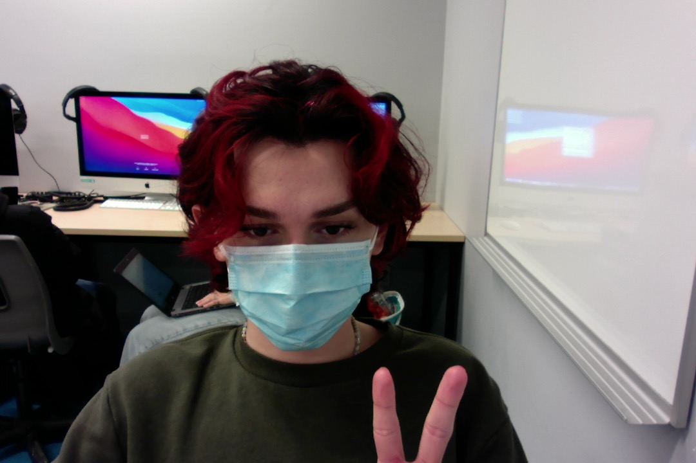

# Volkna Oruncak

En automne 2020, j'avais fait une session en gestion de commerce, mais j'ai réalisé que ce n'était pas le programme pour moi. J'avais choisi de prendre une pause pour la session d'hver et j'ai recommence en automne 2021 dans le programme TIM.
